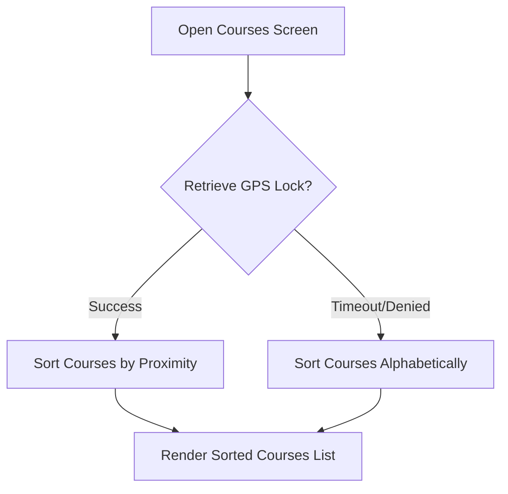
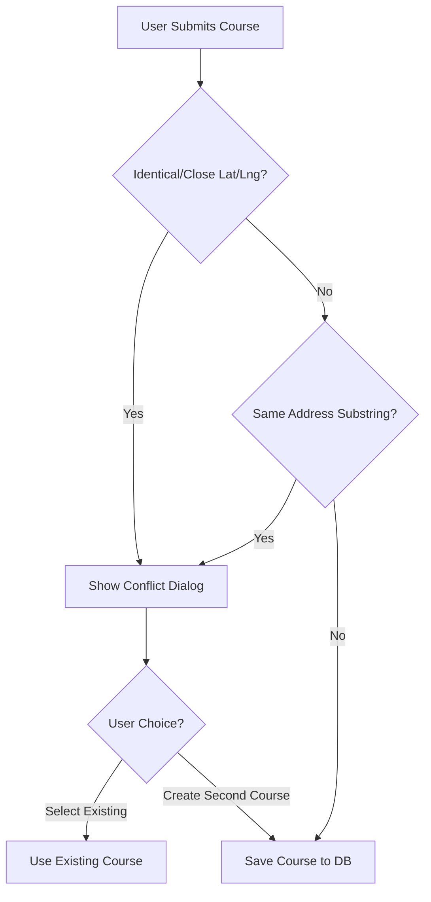

# Course Location Awareness & Duplicate Prevention

This document describes the design, implementation, and UX flow for the location-aware features introduced during course selection, creation, and duplication management.

---

## 1. Product Rules & Goals

* **Proximity Prioritization**: When the user allows location permissions, the course selection list displays the nearest courses first.
* **Fallback Address Resolution**: If location permissions are denied, the user can manually enter an optional address when adding a course.
* **Proactive Duplicate Warning**: Prevent the accidental creation of duplicate courses while fully supporting multi-course facilities (e.g., Chucksters in Hooksett, NH, which has both the *Fire Tower Course* and the *Case Course* at the exact same location/address).
* **Flexible Resolution**: If a duplicate is suspected during course creation or editing, the user is presented with a conflict warning that allows them to either:
  1. Select the existing course at that location.
  2. Bypassing the conflict to create a distinct, secondary course at the same site.

---

## 2. Technical Design & User Flow

### A. Course Selection Screen Flow



1. **Initial Load**: The screen immediately sets `_isLoading = true` and loads the current course database from Firestore/SQLite. The interface renders the "Preparing the Greens..." loading animation.
2. **Concurrent GPS Lock**: In the background, `_getCurrentLocation()` fetches the device's current location via the `geolocator` package.
3. **Dynamic Re-sorting**: If the GPS lock succeeds, the list is dynamically re-sorted by proximity using the Haversine distance formula. If GPS fails or is denied, the list remains sorted alphabetically.

---

### B. Conflict & Duplicate Validation Flow

When a user creates a new course or edits an existing course, the app performs validation before writing to the database:



* **Distance Threshold**: A coordinate match is triggered if the new coordinates are within **100 meters** of an existing course.
* **Address Match**: A text address match is triggered if the normalized address matches or shares a substantial substring with an existing course.

---

## 3. Implementation Details

### Core APIs & Configurations

#### 1. GPS Retrieval Settings

We utilize the upgraded `LocationSettings` API from the `geolocator` package to ensure high accuracy with a strict safety timeout:

```dart
Position position = await Geolocator.getCurrentPosition(
  locationSettings: const LocationSettings(
    accuracy: LocationAccuracy.high,
    timeLimit: Duration(seconds: 5),
  ),
);
```

#### 2. Concurrency & Microtasks

To ensure unit and widget tests function perfectly without rendering empty placeholders or skipping the loading frame, `initState()` triggers `_getCurrentLocation()` concurrently with `_initializeCourses()`:

```dart
Future<void> _initData() async {
  _getCurrentLocation().then((_) {
    if (mounted) {
      _sortCoursesByProximity();
    }
  });
  await _initializeCourses();
}
```

#### 3. Secured Asynchronous Contexts

To prevent memory leaks or crashes when displaying conflict dialogs across asynchronous calls, every UI action verifies that the `BuildContext` is still mounted:

```dart
if (!context.mounted) return;
final proceed = await _showLocationConflictDialog(context, conflicts);
if (proceed != true) return;
```

---

## 4. Database Schema Support

* **Latitude/Longitude**: Represented as floating-point coordinate fields inside the course document.
* **Address**: A clean, normalized text string field used for matching.
